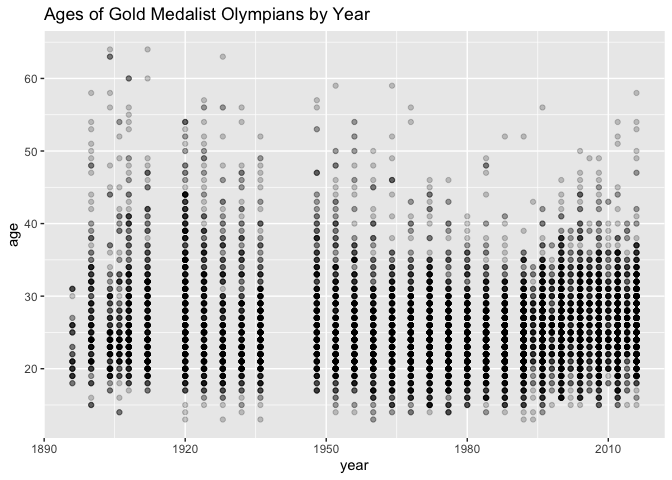
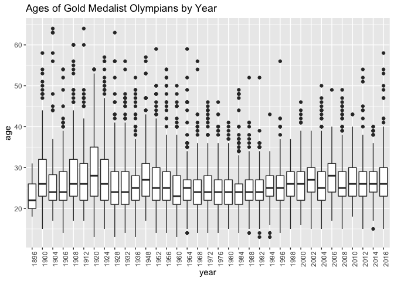
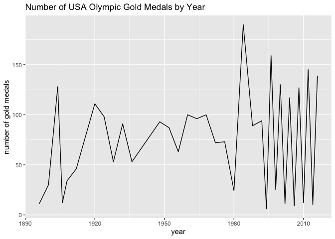
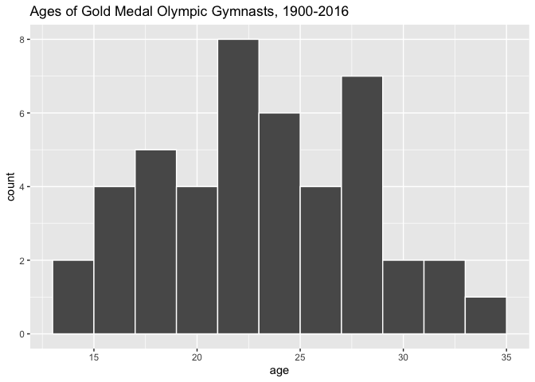
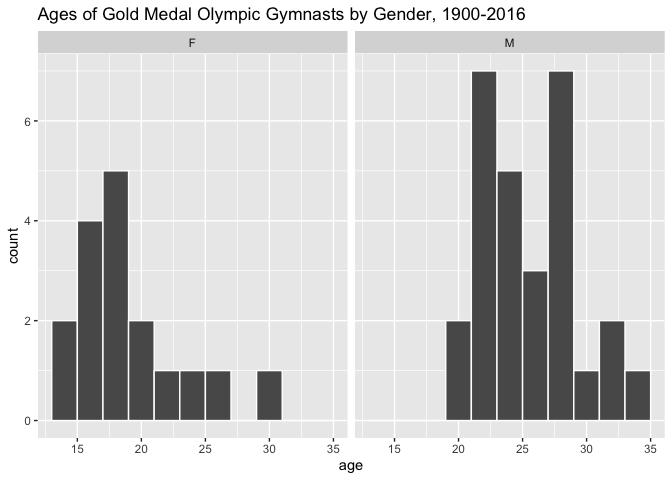
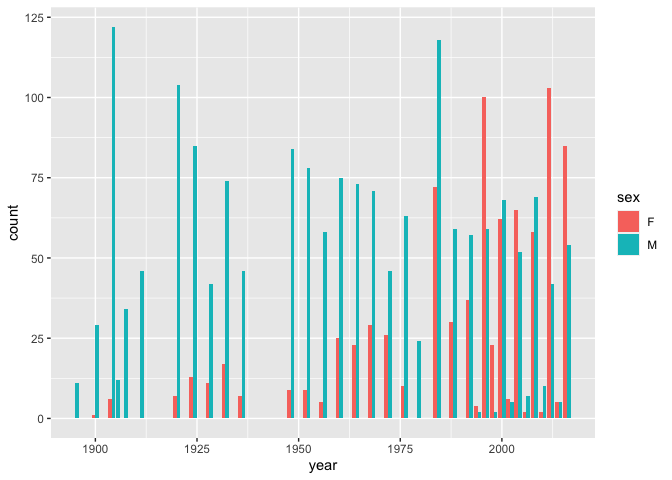

# MD 1

## Question 1


```r
install.packages("causact")
install.packages("dplyr")
install.packages("igraph")
```

## Question 2


```r
library(causact)
library(dplyr)
```

```
## 
## Attaching package: 'dplyr'
```

```
## The following objects are masked from 'package:stats':
## 
##     filter, lag
```

```
## The following objects are masked from 'package:base':
## 
##     intersect, setdiff, setequal, union
```

```r
library(igraph)
```

```
## 
## Attaching package: 'igraph'
```

```
## The following objects are masked from 'package:dplyr':
## 
##     as_data_frame, groups, union
```

```
## The following objects are masked from 'package:stats':
## 
##     decompose, spectrum
```

```
## The following object is masked from 'package:base':
## 
##     union
```

```r
df <- as_data_frame(x = c(1,2,3))
```

```
## Error in as_data_frame(x = c(1, 2, 3)): Not a graph object
```

Got the expected error.


```r
df <- dplyr::as_data_frame(x = c(1,2,3))
```

```
## Warning: `as_data_frame()` was deprecated in tibble 2.0.0.
## Please use `as_tibble()` instead.
## The signature and semantics have changed, see `?as_tibble`.
## This warning is displayed once every 8 hours.
## Call `lifecycle::last_lifecycle_warnings()` to see where this warning was generated.
```


```r
glimpse(df)
```

```
## Rows: 3
## Columns: 1
## $ value <dbl> 1, 2, 3
```


```r
x <- c(5,6,2,7,9,1)
dplyr::n_distinct(x)
```

```
## [1] 6
```

R called the as_data_frame function from igraph instead of dplyr because igraph was loaded after dplyr was already loaded, thus overriding the dplyr as_data_frame function.

## Question 3


```r
?n_distinct
```

The n_distinct function counts the number of unique, non-repeated values within a given vector.

## Question 4


```r
glimpse(baseballData)
```

```
## Rows: 12,145
## Columns: 5
## $ Date         <int> 20100405, 20100405, 20100405, 20100405, 20100405, 2010040…
## $ Home         <fct> ANA, CHA, KCA, OAK, TEX, ARI, ATL, CIN, HOU, MIL, NYN, PI…
## $ Visitor      <fct> MIN, CLE, DET, SEA, TOR, SDN, CHN, SLN, SFN, COL, FLO, LA…
## $ HomeScore    <int> 6, 6, 4, 3, 5, 6, 16, 6, 2, 3, 7, 11, 1, 3, 4, 2, 4, 3, 0…
## $ VisitorScore <int> 3, 0, 8, 5, 4, 3, 5, 11, 5, 5, 1, 5, 11, 5, 6, 1, 3, 6, 3…
```

This dataset has 12,145 rows and 5 columns. "Home" is a factor variable and "HomeScore" is an integer variable.

## Question 5


```r
baseballData[1,]
```

```
##       Date Home Visitor HomeScore VisitorScore
## 1 20100405  ANA     MIN         6            3
```

One row represents one baseball game.


```r
baseballData[,2:3] %>% head()
```

```
##   Home Visitor
## 1  ANA     MIN
## 2  CHA     CLE
## 3  KCA     DET
## 4  OAK     SEA
## 5  TEX     TOR
## 6  ARI     SDN
```

These two columns represent the teams (home and visitor) playing in the baseball game.

## Question 6


```r
name <-
  c(
    "Wayne Gretzky",
    "Gordie Howe",
    "Jaromir Jagr",
    "Brett Hull",
    "Marcel Dionne",
    "Phil Esposito" ,
    "Mike Gartner",
    "Alex Ovechkin",
    "Mark Messier" ,
    "Steve Yzerman"
  )

goals <- c(894, 801, 766, 741, 731, 717, 708, 700, 694, 692)

year_started <- c(1979, 1946, 1990, 1986, 1971, 1963, 1979, 2005, 1979, 1983)

hockey_df <- tibble(
  PlayerName=name, 
  Goals=goals, 
  YearStarted=year_started)
glimpse(hockey_df)
```

```
## Rows: 10
## Columns: 3
## $ PlayerName  <chr> "Wayne Gretzky", "Gordie Howe", "Jaromir Jagr", "Brett Hul…
## $ Goals       <dbl> 894, 801, 766, 741, 731, 717, 708, 700, 694, 692
## $ YearStarted <dbl> 1979, 1946, 1990, 1986, 1971, 1963, 1979, 2005, 1979, 1983
```

# MD 2


```r
library(tidyverse)
```

```
## ── Attaching packages ─────────────────────────────────────── tidyverse 1.3.2 ──
## ✔ ggplot2 3.3.6     ✔ purrr   0.3.4
## ✔ tibble  3.1.8     ✔ stringr 1.4.1
## ✔ tidyr   1.2.0     ✔ forcats 0.5.2
## ✔ readr   2.1.2     
## ── Conflicts ────────────────────────────────────────── tidyverse_conflicts() ──
## ✖ tibble::as_data_frame() masks igraph::as_data_frame(), dplyr::as_data_frame()
## ✖ purrr::compose()        masks igraph::compose()
## ✖ tidyr::crossing()       masks igraph::crossing()
## ✖ dplyr::filter()         masks stats::filter()
## ✖ igraph::groups()        masks dplyr::groups()
## ✖ dplyr::lag()            masks stats::lag()
## ✖ purrr::simplify()       masks igraph::simplify()
```

```r
olympics  <- read_csv('https://raw.githubusercontent.com/rfordatascience/tidytuesday/master/data/2021/2021-07-27/olympics.csv')
```

```
## Rows: 271116 Columns: 15
## ── Column specification ────────────────────────────────────────────────────────
## Delimiter: ","
## chr (10): name, sex, team, noc, games, season, city, sport, event, medal
## dbl  (5): id, age, height, weight, year
## 
## ℹ Use `spec()` to retrieve the full column specification for this data.
## ℹ Specify the column types or set `show_col_types = FALSE` to quiet this message.
```

```r
glimpse(olympics)
```

```
## Rows: 271,116
## Columns: 15
## $ id     <dbl> 1, 2, 3, 4, 5, 5, 5, 5, 5, 5, 6, 6, 6, 6, 6, 6, 6, 6, 7, 7, 7, …
## $ name   <chr> "A Dijiang", "A Lamusi", "Gunnar Nielsen Aaby", "Edgar Lindenau…
## $ sex    <chr> "M", "M", "M", "M", "F", "F", "F", "F", "F", "F", "M", "M", "M"…
## $ age    <dbl> 24, 23, 24, 34, 21, 21, 25, 25, 27, 27, 31, 31, 31, 31, 33, 33,…
## $ height <dbl> 180, 170, NA, NA, 185, 185, 185, 185, 185, 185, 188, 188, 188, …
## $ weight <dbl> 80, 60, NA, NA, 82, 82, 82, 82, 82, 82, 75, 75, 75, 75, 75, 75,…
## $ team   <chr> "China", "China", "Denmark", "Denmark/Sweden", "Netherlands", "…
## $ noc    <chr> "CHN", "CHN", "DEN", "DEN", "NED", "NED", "NED", "NED", "NED", …
## $ games  <chr> "1992 Summer", "2012 Summer", "1920 Summer", "1900 Summer", "19…
## $ year   <dbl> 1992, 2012, 1920, 1900, 1988, 1988, 1992, 1992, 1994, 1994, 199…
## $ season <chr> "Summer", "Summer", "Summer", "Summer", "Winter", "Winter", "Wi…
## $ city   <chr> "Barcelona", "London", "Antwerpen", "Paris", "Calgary", "Calgar…
## $ sport  <chr> "Basketball", "Judo", "Football", "Tug-Of-War", "Speed Skating"…
## $ event  <chr> "Basketball Men's Basketball", "Judo Men's Extra-Lightweight", …
## $ medal  <chr> NA, NA, NA, "Gold", NA, NA, NA, NA, NA, NA, NA, NA, NA, NA, NA,…
```

```r
table(olympics$medal)
```

```
## 
## Bronze   Gold Silver 
##  13295  13372  13116
```

## Question 1


```r
gold_medalists <- olympics %>% 
  filter(medal == "Gold")
glimpse(gold_medalists)
```

```
## Rows: 13,372
## Columns: 15
## $ id     <dbl> 4, 17, 17, 17, 20, 20, 20, 20, 21, 40, 42, 56, 72, 73, 73, 76, …
## $ name   <chr> "Edgar Lindenau Aabye", "Paavo Johannes Aaltonen", "Paavo Johan…
## $ sex    <chr> "M", "M", "M", "M", "M", "M", "M", "M", "F", "M", "M", "M", "M"…
## $ age    <dbl> 34, 28, 28, 28, 20, 30, 30, 34, 27, 31, 25, 21, 28, 23, 27, 22,…
## $ height <dbl> NA, 175, 175, 175, 176, 176, 176, 176, 163, NA, NA, NA, 180, 18…
## $ weight <dbl> NA, 64, 64, 64, 85, 85, 85, 85, NA, NA, NA, NA, 83, 86, 86, 82,…
## $ team   <chr> "Denmark/Sweden", "Finland", "Finland", "Finland", "Norway", "N…
## $ noc    <chr> "DEN", "FIN", "FIN", "FIN", "NOR", "NOR", "NOR", "NOR", "NOR", …
## $ games  <chr> "1900 Summer", "1948 Summer", "1948 Summer", "1948 Summer", "19…
## $ year   <dbl> 1900, 1948, 1948, 1948, 1992, 2002, 2002, 2006, 2008, 1960, 191…
## $ season <chr> "Summer", "Summer", "Summer", "Summer", "Winter", "Winter", "Wi…
## $ city   <chr> "Paris", "London", "London", "London", "Albertville", "Salt Lak…
## $ sport  <chr> "Tug-Of-War", "Gymnastics", "Gymnastics", "Gymnastics", "Alpine…
## $ event  <chr> "Tug-Of-War Men's Tug-Of-War", "Gymnastics Men's Team All-Aroun…
## $ medal  <chr> "Gold", "Gold", "Gold", "Gold", "Gold", "Gold", "Gold", "Gold",…
```

The resulting dataset has 13,372 rows.

## Question 2


```r
ggplot(data=gold_medalists, 
       mapping=aes(x=year, y=age)) +
  geom_point(alpha=.2) + labs(title="Ages of Gold Medalist Olympians by Year")
```

```
## Warning: Removed 148 rows containing missing values (geom_point).
```

<!-- -->

A scatterplot is most appropriate given that there are multiple observations for each year. That said, this graph is quite difficult to interpret, but it appears that over time the average age of gold medalists, and the variance in the age of gold metalists, have decreased. The visualization will need to be improved to confirm this.


```r
ggplot(data=gold_medalists, mapping=aes(x=factor(year), y=age)) +
  geom_boxplot() + theme(axis.text.x = element_text(angle = 90)) + labs(x="year", title="Ages of Gold Medalist Olympians by Year")
```

```
## Warning: Removed 148 rows containing non-finite values (stat_boxplot).
```

<!-- -->

This seems like an improvement even compared to the scatterplot with the adjusted transparency, which itself is an improvement over a scatterplot with no transparency. 

## Question 3


```r
us_medals <- gold_medalists %>% 
  filter(noc == "USA") %>% 
  group_by(year) %>% 
  summarise(num_medals = n())
ggplot(data=us_medals, mapping=aes(x=year, y=num_medals)) + geom_line() + labs(x="number of gold medals", title="Number of USA Olympic Gold Medals by Year")
```

<!-- -->

The country's most successful year was 1984, when the USA won 190 gold medals. I am guessing that the line is so wiggly towards the end because the USA typically is stronger at Summer Olympic sports than Winter Olympic sports. Prior to 1994, the Summer and Winter Games were held the same year, every four years, but beginning in 1994 they were separated and held every two years which explains why the line gets so wiggly towards the end.

## Question 4


```r
two_events <- gold_medalists %>%
  filter(
    event == "Gymnastics Men's Individual All-Around"  |
      event == "Gymnastics Women's Individual All-Around" |
      event == "Athletics Women's 100 metres"   |
      event == "Athletics Men's 100 metres"
  ) 
```

Now I will filter this dataset so that it only contains the gymnastics events.


```r
gymnastics <- two_events %>% 
  filter(
    event == "Gymnastics Men's Individual All-Around"  |
    event == "Gymnastics Women's Individual All-Around")
```

Next, I will create a histogram of the gold medal gymnasts' ages.


```r
ggplot(data=gymnastics, mapping=aes(x=age)) +
  geom_histogram(binwidth = 2, color="white") + labs(title="Ages of Gold Medal Olympic Gymnasts, 1900-2016")
```

<!-- -->

Most gold medal gymnasts are in their twenties. The distribution seems to be bimodal and right-skewed.


```r
ggplot(data=gymnastics, mapping=aes(x=age)) +
  geom_histogram(binwidth = 2, color="white") +
  facet_wrap(~sex) + labs(title="Ages of Gold Medal Olympic Gymnasts by Gender, 1900-2016")
```

<!-- -->

Male gold medal gymnasts tend to be older than female gold medal gymnasts.

## Question 5

I was unsure about if "events" was in reference to the two events of two_events or the events column, so I went with the former.


```r
ggplot(data=two_events, mapping=aes(x=factor(sport), y=height)) +
  geom_boxplot() + 
  labs(x="event", title="Olympic Gold Medalist Heights by Athletic Event") + 
  scale_x_discrete(labels=c("Athletics"="100 Meter Dash"))
```

```
## Warning: Removed 10 rows containing non-finite values (stat_boxplot).
```

<!-- -->

The 100 meter dash has taller athletes overall than  gymnastics.

## Question 6

```r
us_medalists <- gold_medalists %>% 
  filter(noc == "USA")
ggplot(data=us_medalists, mapping=aes(x=year, fill=sex)) +
  geom_bar(position=position_dodge(preserve = "single"))
```

<!-- -->

The frequency of females winning gold medals compared to males increased noticeably in the late 1970s, perhaps as a result of the women's liberation movement.
