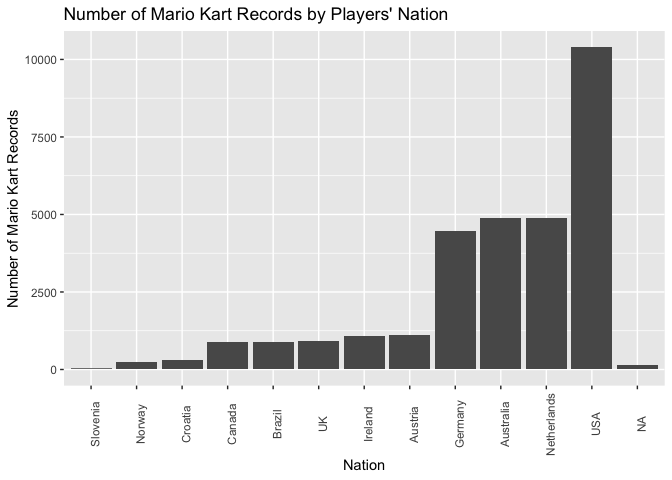
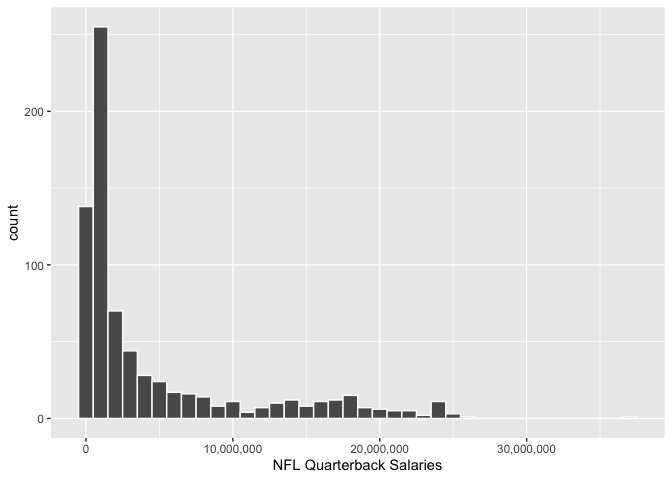
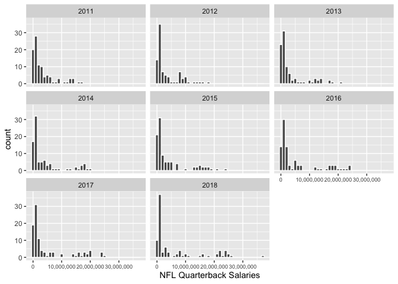
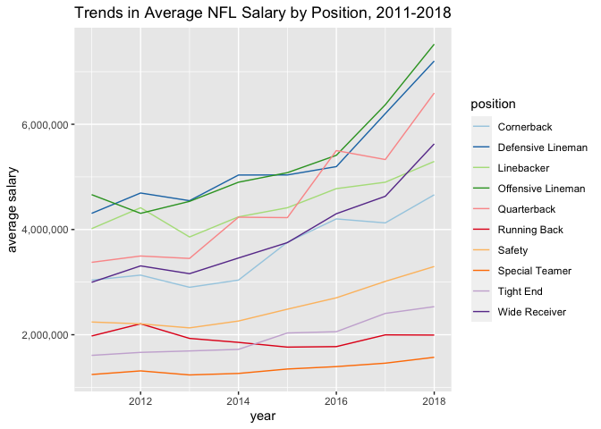

# MD 3


```r
library(tidyverse)
mario_kart <- read_csv("~/Documents/GitHub/223_course/Data/world_records.csv")
glimpse(mario_kart)
```

```
## Rows: 2,334
## Columns: 9
## $ track           <chr> "Luigi Raceway", "Luigi Raceway", "Luigi Raceway", "Lu…
## $ type            <chr> "Three Lap", "Three Lap", "Three Lap", "Three Lap", "T…
## $ shortcut        <chr> "No", "No", "No", "No", "No", "No", "No", "No", "No", …
## $ player          <chr> "Salam", "Booth", "Salam", "Salam", "Gregg G", "Rocky …
## $ system_played   <chr> "NTSC", "NTSC", "NTSC", "NTSC", "NTSC", "NTSC", "NTSC"…
## $ date            <date> 1997-02-15, 1997-02-16, 1997-02-16, 1997-02-28, 1997-…
## $ time_period     <chr> "2M 12.99S", "2M 9.99S", "2M 8.99S", "2M 6.99S", "2M 4…
## $ time            <dbl> 132.99, 129.99, 128.99, 126.99, 124.51, 122.89, 122.87…
## $ record_duration <dbl> 1, 0, 12, 7, 54, 0, 0, 27, 0, 64, 3, 0, 90, 132, 1, 74…
```

## Question 1

```r
three_laps <- mario_kart %>% filter(type == "Three Lap")
no_rainbow_rd <- three_laps %>% filter(track != "Rainbow Road")
rainbow_rd <- three_laps %>%  filter(track == "Rainbow Road")
```

Above, I use the filter function to create one dataset containing only Rainbow Road records, and one dataset that excludes all Rainbow Road records. 

## Question 2

```r
rainbow_rd_summary <- rainbow_rd %>% summarise (rainbow_mean=mean(time), rainbow_sd=sd(time))
rainbow_rd_summary
```

```
## # A tibble: 1 × 2
##   rainbow_mean rainbow_sd
##          <dbl>      <dbl>
## 1         276.       91.8
```

```r
all_others_summary <- no_rainbow_rd %>% summarise(all_others_mean=mean(time), all_others_sd=sd(time))
all_others_summary
```

```
## # A tibble: 1 × 2
##   all_others_mean all_others_sd
##             <dbl>         <dbl>
## 1            114.          53.0
```

The Rainbow Road records have a longer mean time and larger standard deviation compared to the mean and standard deviation completion time for all other tracks combined.

## Question 3

```r
track_records <- three_laps %>% 
  group_by(track) %>% 
  summarize(record_count=n()) %>% 
  arrange(desc(record_count))
track_records
```

```
## # A tibble: 16 × 2
##    track                 record_count
##    <chr>                        <int>
##  1 Toad's Turnpike                124
##  2 Rainbow Road                    99
##  3 Frappe Snowland                 92
##  4 D.K.'s Jungle Parkway           86
##  5 Choco Mountain                  84
##  6 Mario Raceway                   82
##  7 Luigi Raceway                   81
##  8 Royal Raceway                   77
##  9 Yoshi Valley                    74
## 10 Kalimari Desert                 73
## 11 Sherbet Land                    73
## 12 Wario Stadium                   71
## 13 Koopa Troopa Beach              56
## 14 Banshee Boardwalk               55
## 15 Moo Moo Farm                    44
## 16 Bowser's Castle                 40
```

Toad's Turnpike has the most records established in it.

## Question 4

```r
driver_records <- three_laps %>% 
  group_by(player, track) %>% 
  summarize(record_count=n()) %>% 
  arrange(desc(record_count))
driver_records
```

```
## # A tibble: 306 × 3
## # Groups:   player [60]
##    player   track                 record_count
##    <chr>    <chr>                        <int>
##  1 Penev    Choco Mountain                  26
##  2 Lacey    D.K.'s Jungle Parkway           24
##  3 abney317 Rainbow Road                    21
##  4 MR       Toad's Turnpike                 20
##  5 MR       Frappe Snowland                 18
##  6 Penev    Toad's Turnpike                 18
##  7 abney317 Kalimari Desert                 16
##  8 MR       Sherbet Land                    16
##  9 abney317 Choco Mountain                  15
## 10 abney317 Toad's Turnpike                 15
## # … with 296 more rows
```

Penev has recorded the most records at any one track, and that track was Choco Mountain.

## Question 5

```r
three_laps %>% 
  group_by(track) %>% 
  summarize(mean_time=mean(time)) %>% 
  arrange(desc(mean_time))
```

```
## # A tibble: 16 × 2
##    track                 mean_time
##    <chr>                     <dbl>
##  1 Rainbow Road              276. 
##  2 Wario Stadium             214. 
##  3 Royal Raceway             158. 
##  4 Bowser's Castle           134. 
##  5 Kalimari Desert           126. 
##  6 Banshee Boardwalk         126. 
##  7 Toad's Turnpike           122. 
##  8 Sherbet Land              116. 
##  9 Luigi Raceway             104. 
## 10 D.K.'s Jungle Parkway     101. 
## 11 Koopa Troopa Beach         96.6
## 12 Choco Mountain             95.2
## 13 Moo Moo Farm               88.4
## 14 Yoshi Valley               82.7
## 15 Mario Raceway              79.1
## 16 Frappe Snowland            77.1
```

The average time for each track is shown above. Rainbow Road, as expected, has the longest average time.


```r
ungroup(three_laps)
```

```
## # A tibble: 1,211 × 9
##    track         type    short…¹ player syste…² date       time_…³  time recor…⁴
##    <chr>         <chr>   <chr>   <chr>  <chr>   <date>     <chr>   <dbl>   <dbl>
##  1 Luigi Raceway Three … No      Salam  NTSC    1997-02-15 2M 12.…  133.       1
##  2 Luigi Raceway Three … No      Booth  NTSC    1997-02-16 2M 9.9…  130.       0
##  3 Luigi Raceway Three … No      Salam  NTSC    1997-02-16 2M 8.9…  129.      12
##  4 Luigi Raceway Three … No      Salam  NTSC    1997-02-28 2M 6.9…  127.       7
##  5 Luigi Raceway Three … No      Gregg… NTSC    1997-03-07 2M 4.5…  125.      54
##  6 Luigi Raceway Three … No      Rocky… NTSC    1997-04-30 2M 2.8…  123.       0
##  7 Luigi Raceway Three … No      Launs… NTSC    1997-04-30 2M 2.8…  123.       0
##  8 Luigi Raceway Three … No      Launs… NTSC    1997-04-30 2M 2.7…  123.      27
##  9 Luigi Raceway Three … No      Launs… NTSC    1997-05-27 2M 2.2…  122.       0
## 10 Luigi Raceway Three … No      Launs… NTSC    1997-05-27 2M 2.2…  122.      64
## # … with 1,201 more rows, and abbreviated variable names ¹​shortcut,
## #   ²​system_played, ³​time_period, ⁴​record_duration
```

```r
three_laps %>% 
  group_by(track) %>% 
  arrange(time) %>% 
  select(track, time) %>% 
  slice(1)
```

```
## # A tibble: 16 × 2
## # Groups:   track [16]
##    track                  time
##    <chr>                 <dbl>
##  1 Banshee Boardwalk     124. 
##  2 Bowser's Castle       132  
##  3 Choco Mountain         17.3
##  4 D.K.'s Jungle Parkway  21.4
##  5 Frappe Snowland        23.6
##  6 Kalimari Desert       122. 
##  7 Koopa Troopa Beach     95.2
##  8 Luigi Raceway          25.3
##  9 Mario Raceway          58.5
## 10 Moo Moo Farm           85.9
## 11 Rainbow Road           50.4
## 12 Royal Raceway         119. 
## 13 Sherbet Land           91.6
## 14 Toad's Turnpike        30.3
## 15 Wario Stadium          14.6
## 16 Yoshi Valley           33.4
```

The fastest time for each track is shown above.

## Question 6

```r
three_laps %>% 
  mutate(duration_over_100=case_when(record_duration>100 ~ 1,
                                     record_duration<=100 ~ 0)) %>% 
  group_by(player) %>% 
  summarize(long_dur_count=sum(duration_over_100)) %>% 
  arrange(desc(long_dur_count))
```

```
## # A tibble: 60 × 2
##    player   long_dur_count
##    <chr>             <dbl>
##  1 MR                   81
##  2 MJ                   50
##  3 Penev                27
##  4 abney317             26
##  5 VAJ                  26
##  6 Zwartjes             24
##  7 Lacey                23
##  8 Dan                  21
##  9 Karlo                18
## 10 Booth                17
## # … with 50 more rows
```

The total amount of long duration records (over 100 days) that each player holds are above. MR has the most long duration records (81).

## Question 7

```r
drivers <- read_csv("~/Documents/GitHub/223_course/Data/drivers.csv")
mario_joined <- left_join(three_laps, drivers, by='player')
mario_joined %>% 
  count(nation) %>% 
  ggplot(mapping=aes(x=fct_reorder(nation, n), y=n)) +
  geom_col() +
  theme(axis.text.x = element_text(angle = 90)) +
  labs(x="Nation", y="Number of Mario Kart Records", 
       title="Number of Mario Kart Records by Players' Nation") 
```

<!-- -->

# MD 4

## Question 1

```r
nfl_salaries <- read_csv("https://raw.githubusercontent.com/NicolasRestrep/223_course/main/Data/nfl_salaries.csv")
nfl_salaries
```

```
## # A tibble: 800 × 11
##     year Corner…¹ Defen…² Lineb…³ Offen…⁴ Quart…⁵ Runni…⁶ Safety Speci…⁷ Tight…⁸
##    <dbl>    <dbl>   <dbl>   <dbl>   <dbl>   <dbl>   <dbl>  <dbl>   <dbl>   <dbl>
##  1  2011 11265916  1.78e7  1.64e7  1.60e7  1.72e7  1.30e7 8.87e6 4300000 8734375
##  2  2011 11000000  1.62e7  1.56e7  1.28e7  1.6 e7  1.09e7 8.79e6 3725000 8591000
##  3  2011 10000000  1.25e7  1.18e7  1.18e7  1.44e7  9.48e6 8.28e6 3556176 8290000
##  4  2011 10000000  1.19e7  1.01e7  1.04e7  1.41e7  7.7 e6 8   e6 3500000 7723333
##  5  2011 10000000  1.18e7  1.00e7  1   e7  1.35e7  7.5 e6 7.80e6 3250000 6974666
##  6  2011  9244117  1.13e7  8.15e6  9.86e6  1.32e7  7.03e6 7.65e6 3225000 6133333
##  7  2011  8000000  1   e7  7.81e6  9.5 e6  1.30e7  6.75e6 7.55e6 2900000 5962500
##  8  2011  7900000  9.48e6  7.7 e6  9.42e6  1.26e7  6.37e6 7.5 e6 2850000 4687500
##  9  2011  7400000  8.45e6  7.2 e6  8.88e6  1.25e7  6   e6 5.74e6 2600000 4536666
## 10  2011  7000000  8.38e6  7.1 e6  8.69e6  1.13e7  4.93e6 5.25e6 2600000 4200000
## # … with 790 more rows, 1 more variable: `Wide Receiver` <dbl>, and abbreviated
## #   variable names ¹​Cornerback, ²​`Defensive Lineman`, ³​Linebacker,
## #   ⁴​`Offensive Lineman`, ⁵​Quarterback, ⁶​`Running Back`, ⁷​`Special Teamer`,
## #   ⁸​`Tight End`
```

## Question 2

```r
nfl_salaries_tidy <- nfl_salaries %>% 
  pivot_longer(names_to= "position",
               values_to= "salary",
               cols= -year)
nfl_salaries_tidy
```

```
## # A tibble: 8,000 × 3
##     year position            salary
##    <dbl> <chr>                <dbl>
##  1  2011 Cornerback        11265916
##  2  2011 Defensive Lineman 17818000
##  3  2011 Linebacker        16420000
##  4  2011 Offensive Lineman 15960000
##  5  2011 Quarterback       17228125
##  6  2011 Running Back      12955000
##  7  2011 Safety             8871428
##  8  2011 Special Teamer     4300000
##  9  2011 Tight End          8734375
## 10  2011 Wide Receiver     16250000
## # … with 7,990 more rows
```
## Question 3

```r
quarterbacks <- nfl_salaries_tidy %>% 
  filter(position=="Quarterback")

ggplot(data=quarterbacks, mapping=aes(x=salary)) +
  geom_histogram(color="white", binwidth = 1000000) + 
  scale_x_continuous(name="NFL Quarterback Salaries", labels = scales::comma)
```

```
## Warning: Removed 55 rows containing non-finite values (stat_bin).
```

<!-- -->

```r
ggplot(data=quarterbacks, mapping=aes(x=salary)) +
  geom_histogram(color="white", binwidth = 1000000) + 
  scale_x_continuous(name="NFL Quarterback Salaries", labels = scales::comma) +
  facet_wrap(~year) +
  theme(axis.text.x = element_text(size = 7)) 
```

```
## Warning: Removed 55 rows containing non-finite values (stat_bin).
```

<!-- -->

Over time, there has been an increase in extremely high NFL Quarterback salaries. In 2011, there were not salaries above 20 million, yet we see the prevalence of these high salaries steadily increase over time. 

## Question 4

```r
avg_nfl_salaries <- nfl_salaries_tidy %>% 
  group_by(position, year) %>% 
  summarise(avg_salary=mean(salary, na.rm=TRUE))
avg_nfl_salaries
```

```
## # A tibble: 80 × 3
## # Groups:   position [10]
##    position           year avg_salary
##    <chr>             <dbl>      <dbl>
##  1 Cornerback         2011   3037766.
##  2 Cornerback         2012   3132916.
##  3 Cornerback         2013   2901798.
##  4 Cornerback         2014   3038278.
##  5 Cornerback         2015   3758543.
##  6 Cornerback         2016   4201470.
##  7 Cornerback         2017   4125692.
##  8 Cornerback         2018   4659704.
##  9 Defensive Lineman  2011   4306995.
## 10 Defensive Lineman  2012   4693730.
## # … with 70 more rows
```

## Question 5

```r
library("RColorBrewer")
ggplot(data=avg_nfl_salaries, mapping=aes(x=year, y=avg_salary, group=position, color=position)) +
         geom_line() +
        scale_color_brewer(palette= "Paired") +
  labs(y="average salary", 
       title="Trends in Average NFL Salary by Position, 2011-2018") +
  scale_y_continuous(labels = scales::comma)
```

<!-- -->

For most positions, average salaries have increased between 2011 and 2018, with the exception of running backs. The average salaries of offensive linemen and defensive linemen have increased rapidly since 2016. 
