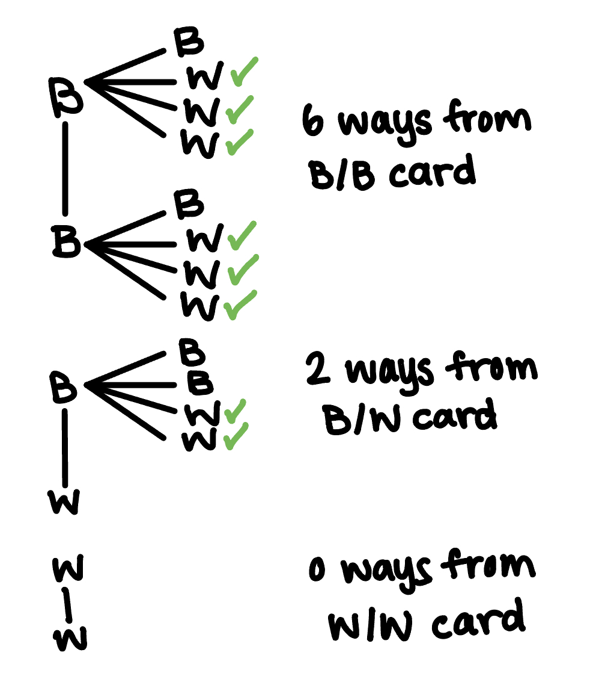

```{r setup, include=FALSE}
knitr::opts_chunk$set(echo = TRUE)
```

```{r, include=FALSE}
library(rethinking)
library(tidyverse)
```

# SR, chapter 2
## Q2E1
(2) and (4) are the correct choices and are equivalent to one another. 

## Q2E2
(3) is the correct answer. 

## Q2E3
(1) and (4) are the correct answers, and are equal as seen in Bayes' theorem. 

## Q2E4
This statement doesn't mean much, as in Bayesian inference, there is no single point estimate such as 0.7. Instead, the estimate of the probability of water is represented by the entire posterior distribution.

## Q2M1
Case 1: W, W, W
```{r}
#define grid
p_grid_1 <- seq(from=0, to=1, length.out=20)

#define prior 
prior <-  rep(1, 20)

# compute likelihood at each value in grid
likelihood_1 <- dbinom( 3 , size=3 , prob=p_grid_1 )

# compute product of likelihood and prior
unstd.posterior_1 <- likelihood_1 * prior

# standardize the posterior, so it sums to 1
posterior_1 <- unstd.posterior_1 / sum(unstd.posterior_1)

# plot 
plot_1 <- tibble(p_grid_1, posterior_1)
plot_1 %>% ggplot(aes(x=p_grid_1, y=posterior_1)) +
  geom_point() + geom_line() + theme_minimal() +
  labs(x="probability of water", y="posterior probability")
```

Case 2: W,W,W,L
```{r}
#define grid - done in Case 1

#define prior - done in Case 1

# compute likelihood at each value in grid
likelihood_2 <- dbinom(3 , size=4 , prob=p_grid_1 )

# compute product of likelihood and prior
unstd.posterior_2 <- likelihood_2 * prior

# standardize the posterior, so it sums to 1
posterior_2 <- unstd.posterior_2 / sum(unstd.posterior_2)

# plot 
plot_2 <- tibble(p_grid_1, posterior_2)
plot_2 %>% ggplot(aes(x=p_grid_1, y=posterior_2)) +
  geom_point() + geom_line() + theme_minimal() +
  labs(x="probability of water", y="posterior probability")
```

Case 3: L,W,W,L,W,W,W
```{r}
#define grid - done in Case 1

#define prior - done in Case 1

# compute likelihood at each value in grid
likelihood_3 <- dbinom(5, size=7 , prob=p_grid_1 )

# compute product of likelihood and prior
unstd.posterior_3 <- likelihood_3 * prior

# standardize the posterior, so it sums to 1
posterior_3 <- unstd.posterior_3 / sum(unstd.posterior_3)

# plot 
plot_3 <- tibble(p_grid_1, posterior_3)
plot_3 %>% ggplot(aes(x=p_grid_1, y=posterior_3)) +
  geom_point() + geom_line() + theme_minimal() +
  labs(x="probability of water", y="posterior probability")
```

## Q2M2
Case 1: W, W, W
```{r}
#define grid - done in Q2M2

#define prior 
x <- c(0,1)
prior <-  rep(x, each=10) 

# compute likelihood at each value in grid
likelihood_4 <- dbinom( 3 , size=3 , prob=p_grid_1 )

# compute product of likelihood and prior
unstd.posterior_4 <- likelihood_4 * prior

# standardize the posterior, so it sums to 1
posterior_4 <- unstd.posterior_4 / sum(unstd.posterior_4)

# plot 
plot_4 <- tibble(p_grid_1, posterior_4)
plot_4 %>% ggplot(aes(x=p_grid_1, y=posterior_4)) +
  geom_point() + geom_line() + theme_minimal() +
  labs(x="probability of water", y="posterior probability")
```

Case 2: W,W,W,L
```{r}
#define grid - done in Case 1

#define prior - done in Case 1

# compute likelihood at each value in grid
likelihood_5 <- dbinom(3, size=4 , prob=p_grid_1 )

# compute product of likelihood and prior
unstd.posterior_5 <- likelihood_5 * prior

# standardize the posterior, so it sums to 1
posterior_5 <- unstd.posterior_5 / sum(unstd.posterior_5)

# plot 
plot_5 <- tibble(p_grid_1, posterior_5)
plot_5 %>% ggplot(aes(x=p_grid_1, y=posterior_5)) +
  geom_point() + geom_line() + theme_minimal() +
  labs(x="probability of water", y="posterior probability")
```

Case 3: L,W,W,L,W,W,W
```{r}
#define grid - done in Case 1

#define prior - done in Case 1

# compute likelihood at each value in grid
likelihood_6 <- dbinom(5, size=7 , prob=p_grid_1 )

# compute product of likelihood and prior
unstd.posterior_6 <- likelihood_6 * prior

# standardize the posterior, so it sums to 1
posterior_6 <- unstd.posterior_6 / sum(unstd.posterior_6)

# plot 
plot_6 <- tibble(p_grid_1, posterior_6)
plot_6 %>% ggplot(aes(x=p_grid_1, y=posterior_6)) +
  geom_point() + geom_line() + theme_minimal() +
  labs(x="probability of water", y="posterior probability")
```

## Q2M3
$Pr(Earth|land)=\frac{Pr(land|Earth) \times Pr(Earth)}{Pr(land)}$ and\

$Pr(land)=Pr(land|Earth) \times Pr(Earth) + Pr(land|Mars) \times Pr(Mars)=(0.3 \times 0.5) + (1 \times 0.5) = 0.65$ \

therefore $Pr(Earth|land)=\frac{0.3 \times 0.5}{0.62}=0.23$

## Q2M4
For the B/B card there are 2 ways to get the observed data. 
For the B/W card there is 1 way to get the observed data. 
For the W/W card there are no ways to get the observed data. 

There are 3 total ways to get the observed data, and 2/3 of them occur when the B/B card is pulled from the bag. Hence, the probability of the other side of the card also being black is 2/3.

## Q2M5
For the first B/B card there are 2 ways to get the observed data. 
For the B/W card there is 1 way to get the observed data. 
For the W/W card there are no ways to get the observed data. 
For the second B/B card there are 2 ways to get the observed data. 

There are 5 total ways to get the observed data and 4/5 of them occur when one of the B/B cards is pulled from the bag. Hence, the probability of the other side also being black is 4/5. 

## Q2M6
To start, we have the same counts as QM4:
For the B/B card there are 2 ways to get the observed data. 
For the B/W card there is 1 way to get the observed data. 
For the W/W card there are no ways to get the observed data.

Next, we update these counts with our new information about ink weight: 
B/B card: multiply our prior 2 ways by 1, 2*1=2
B/W card: multiply our prior 1 way by 2, 1*2=2
W/W card: multiply our prior 0 ways by 3, 3*0=0

Total count=4, so there is a probability of 2/4 or 1/2 that the other side of the card is also black.

## Q2M7
We know that we have a card with a black side face up and then a new card is shown with a white side face up. If the first card (with the black side showing) were black/black then there are 6 total ways to get this result because after drawing the black/black card (2 ways to show a black side from this card) we would be left with the black/white card and the white/white card (3 total white sides) and 2 * 3 equals 6. If the first card were a black/white card (1 way to show black from this card) then there would be two ways to get the observed data because we would be left with the black/black card and the white/white card (2 total white sides) and 1 * 2 equals 2. There are 0 ways to get the observed data from a white/white card being drawn initially. Hence, there are 8 total ways to get the observed data and 6 of them come from the black/black card so the probability of the first card being black on the other side is 6/8=0.75. 

```{r, echo=FALSE, out.width = '40%'}
knitr:: 
```


# SR, Chapter 3
Set up 
```{r}
d <- tibble(p_grid=seq(from=0, to=1, length.out=1000),
            prior=1) %>% 
  mutate(likelihood=dbinom(6, size = 9, prob = p_grid)) %>% 
  mutate(unstd.posterior=likelihood*prior) %>% 
  mutate(posterior = unstd.posterior / sum(unstd.posterior))

set.seed(100)

samples <- d %>% 
  slice_sample(n=1e4, weight_by=posterior, replace=TRUE)
```

## Q3E1
```{r}
samples %>%
  filter(p_grid < .2) %>% 
  summarise(sum = n() / 1e4)
```

.04% of the posterior probability lies below p=0.2. 

## Q3E2
```{r}
samples %>%
  filter(p_grid > .8) %>% 
  summarise(sum = n() / 1e4)
```

About 11% of the posterior probability lies above p=0.8. 

## Q3E3
```{r}
samples %>%
  filter(p_grid < .8 & p_grid > .2) %>% 
  summarise(sum = n() / 1e4)
```

88.8% of the posterior probability lies between p=0.2 and p=0.8. 

## Q3E4
```{r}
samples %>% 
  pull(p_grid) %>% 
  quantile(prob=.2)
```

20% of the posterior probability lies below about p=0.52. 

## Q3E5
```{r}
samples %>% 
  pull(p_grid) %>% 
  quantile(prob=.8)
```

20% of the posterior probability lies above about p=0.76.

## Q3E6
```{r}
rethinking::HPDI(samples$p_grid, prob=.66)
```

The narrowest interval equal to 66% of the posterior probability is between  p=0.5085085 and p=0.7737738.

## Q3E7
```{r}
# note to self: percentile intervals have equal probability mass in each tail
rethinking::PI(samples$p_grid, prob=.66)
```

Assuming equal probability mass in each tail, 66% of the posterior probability falls between p=0.5025025 and p=0.7697698.

## Q3M1
```{r}
m1 <- tibble(p_grid=seq(from=0, to=1, length.out=1000),
            prior=1) %>% 
  mutate(likelihood=dbinom(8, size = 15, prob = p_grid)) %>% 
  mutate(unstd.posterior=likelihood*prior) %>% 
  mutate(posterior = unstd.posterior / sum(unstd.posterior))

m1 %>% ggplot(aes(x=p_grid, y=posterior)) +
  geom_point() +
  geom_line() +
  theme_minimal() +
  labs(x = "probability of water",
       y = "posterior probability")
```

## 3M2
```{r}
set.seed(100)
m2 <- m1 %>% slice_sample(n =1e4, weight_by = posterior, replace = T)
  
HPDI(m2$p_grid, prob=.9)
```

The 90% HPDI for p, based on this sample of 10,000 values from the grid approximation in M1, is between about p=0.33 and p=0.72.

## 3M3
```{r}
set.seed(100)
m3 <- m2 %>% 
  mutate(post_pred=rbinom(n=1e4, size=15, prob=p_grid)) %>% 
  filter(post_pred==8) %>% 
  summarise(prob8=n()/1e4) %>% 
  glimpse()
```

The probability of observing 8 water in 15 tosses is about 14.5%.

## 3M4
```{r}
set.seed(100)
m4 <- m2 %>% 
    mutate(post_pred=rbinom(n=1e4, size=9, prob=p_grid)) %>% 
  filter(post_pred==6) %>% 
  summarise(prob8=n()/1e4) %>% 
  glimpse()
```

The probability of observing 6 water in 9 tosses is about 18%. 

## 3M5 
```{r}
x <- c(0,1)
m5 <- tibble(p_grid=seq(from=0, to=1, length.out=1000),
            prior=rep(x, each=500)) %>% 
  mutate(likelihood=dbinom(8, size = 15, prob = p_grid)) %>% 
  mutate(unstd.posterior=likelihood*prior) %>% 
  mutate(posterior = unstd.posterior / sum(unstd.posterior))

m5 %>% ggplot(aes(x=p_grid, y=posterior)) +
  geom_point() +
  geom_line() +
  theme_minimal() +
  labs(x = "probability of water",
       y = "posterior probability")
```

While in M1, the posterior distribution is symmetric, in M5 we only get half of a binomial distribution  since the prior is 0 for values of p under 0.5 and therefore the posterior probability for these values of p is also 0. This graph includes the true value p=0.7 and has fewer other values of p with relatively larger posterior probabilities. 

```{r}
set.seed(100)
m5_2 <- m5 %>% slice_sample(n =1e4, weight_by = posterior, replace = T)
  
HPDI(m5_2$p_grid, prob=.9)
```

The 90% HPDI for p, based on this sample of 10,000 values, is between about p=0.5 and p=0.71. This is a more narrow interval than the interval in M2, which makes sense given our entire interval of values of p with any probability mass is half the size as it was in M2. This interval does contain the true value, but just barely. However, I still think it is an improvement as the interval is more narrow. 

```{r}
set.seed(100)
m5_3 <- m5_2 %>% 
  mutate(post_pred=rbinom(n=1e4, size=15, prob=p_grid)) %>% 
  filter(post_pred==8) %>% 
  summarise(prob8=n()/1e4) %>% 
  glimpse()
```

The new probability of observing 8 waters in 15 tosses is about 16%, which is actually pretty close to what I got originally. 

```{r}
set.seed(100)
m5_4 <- m5_2 %>% 
    mutate(post_pred=rbinom(n=1e4, size=9, prob=p_grid)) %>% 
  filter(post_pred==6) %>% 
  summarise(prob8=n()/1e4) %>% 
  glimpse()
```

The new probability of observing 6 waters in 9 tosses is about 23%, which is larger than the 18% probability in the original problem. 

## 3M6
Was going to do something similar to the trial and error method that Ally used but I saw her answer on Ed so feels kind of pointless now as I know what value to shoot for. I'll do 1 hard problem instead. 

## 3H1
```{r}
library(rethinking)
data(homeworkch3)
births_vec <- c(birth1, birth2)
sum(births_vec)
# 111 males out of 200 total births

births <- tibble(p_grid=seq(from=0, to=1, length.out=1000),
            prior=1) %>% 
  mutate(likelihood=dbinom(111, size=200, prob=p_grid)) %>% 
  mutate(unstd.posterior=likelihood*prior) %>% 
  mutate(posterior = unstd.posterior / sum(unstd.posterior))

births %>% ggplot(aes(x=p_grid, y=posterior)) +
  geom_point() +
  geom_line() +
  theme_minimal() +
  labs(x = "probability of boy",
       y = "posterior probability")
```

Now, let's see what parameter value maximizes the posterior probability. 
```{r}
tidybayes::Mode(births$p_grid)
```

The posterior probability is maximized at just over p=0.5.
